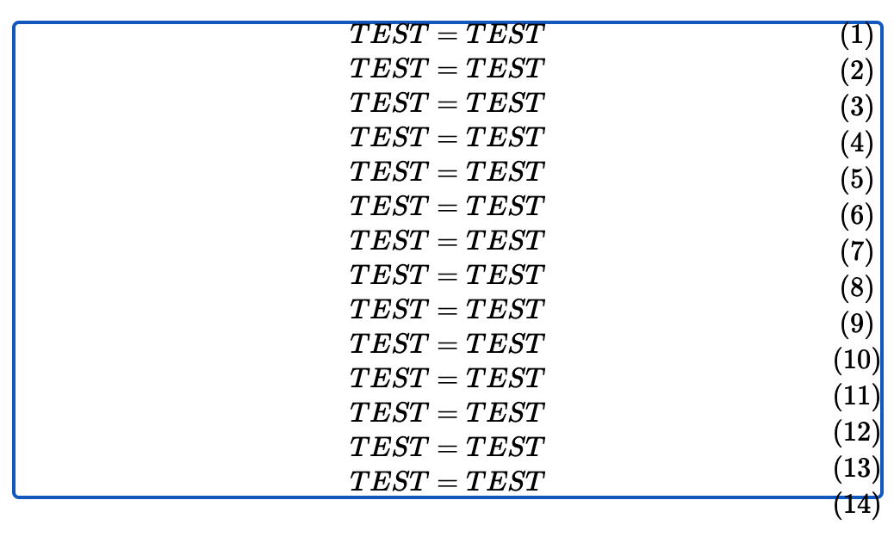
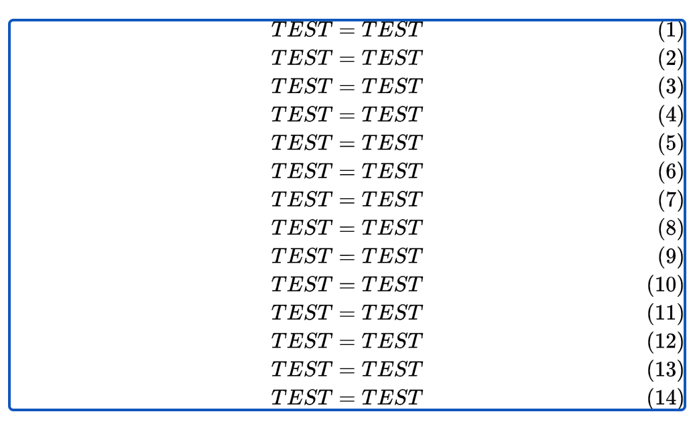
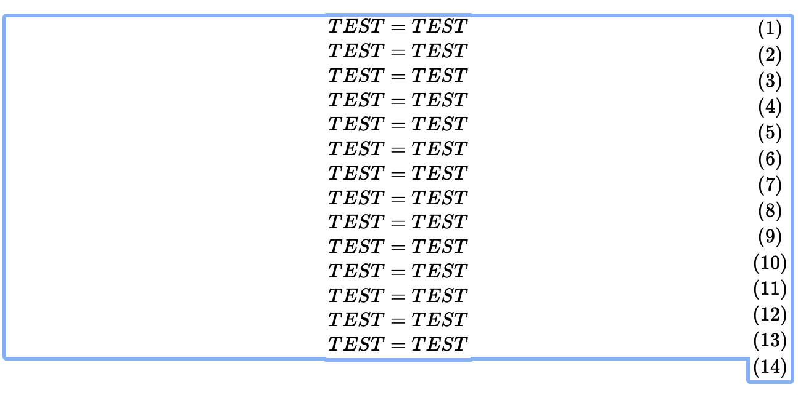

This is a minimal example for the Mathjax Github issue: https://github.com/mathjax/MathJax/issues/2601

Mathjax Version: `3.1.2`
Chrome: 87.0.4280.88 (Official Build) (x86_64)

When rendering using `tex-chtml.js` engine (file [chtml.html](./chtml.html)), the labels on the right render with
wrong height, resulting in the offset. This effect if aggravated if scaled.

When rendering using `tex-svg.js` engine (file [svg.html](./svg.html)), the labels on the right render correctly.

P.S. For safari, it is the same:

